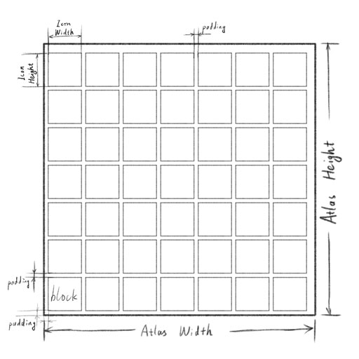
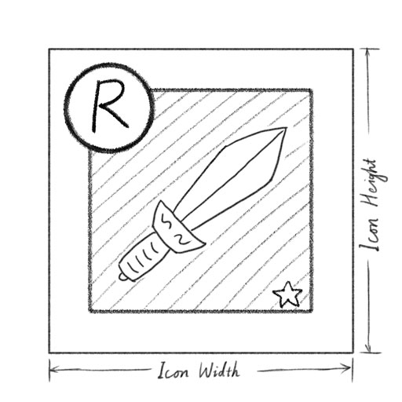

# RenderTextureIcons

---

[中文README](./README_CN.md)

## Glossaries

**Notice :** The glossaries in this document may not match the words in API. In this solution, it is not a consern that what the 'icon' in this document is. They are just source textures.

### Icon

In this document, we name an ’icon‘ to be a texture that shows a specific object in game.

E.g. A 100px \* 100px hero avatar texture. A 100px \* 100px sprite in atlas that shows a equipment.

### Block

In this document, we name a ’block‘ to be a collection of an icon and its background, frames and its visual property elements.

E.g. An item in an item list of your bag UI. An item in your reward list.

## Description

An item block may always consist of a background, an icon, frames and other properties in its corner or by its sides.

A prefab that contains all the foregoings as its children is generic design to make a block functional. Thus the prefab will be referenced by a considerable amount of UI prefabs.

The amount of icon in an MMO game will always be over hundreds.

So the following issues occur.

- It is tough to modify the block prefab.

- A cpu load may occur when showing a bag UI that may contains hundreds or even thousands of UGUI Images.

- When using sprite atlas to pack icons, more atlas textures are required. Memory cost may become a concern.

- Draw call increasement when dealing with more textures and even texts.

- Overdraw in block area.

- A full block color tint or grayscale or semi-transparent may be difficult.

With this library :

- An item block gameObject requires only ONE RawImage in its hierarchy.

- All contents that the RawImage components render are in a same texture.

- Color transformation on part or all block elements will be easy.

But you should :

- Draw everything in the block by calling drawing API.

- Alloc a sector from atlas and release it manually in your drawing logic.

- Redraw your block when required. Because RenderTexture may be released in some cases.

### Advantages

- Much fewer UI elements is required, and fewer CPU load when initiating block UIs.

- Much fewer drawcall and in-block overdraws per frame.

- When initiating block UIs, GPU renders the blocks. Thus it makes good use of hardwear resources.

- With text-render-to-texture tools, more optimization can be achieved.

- Full block FXs are easy to deal with.

- Icon textures are loaded only when required, and can be release right after calling the drawing api.

### Limitations

- All block UI are of same size, or scaling is accepted.

- All texture sources in block are not animated.

- There is a maximum of the amount of active blocks. And will never exceed it because of your UI optimizaion.

## Core Types

### RenderTextureIcons

The core class of this soluation. It manages the atlas, deals with the texture rendering and provides the API for following functions.

- Atlas texture getter property

- Sector Alloc and Release methods (`AllocIcon` and `ReleaseIcon`)

- Drawing and Clearing methods

### IconDrawProperties

A data struct that defines the following additional drawing properties.

- Draw Region

- Color Transformation

- 9-sliced properties

- Mask

### ColorMatrix

It's used by IconDrawProperties to specify how texture color transforms when drawing.

Final Color `out` calculated from `in` with matrix `m` :

    out.r = in.r * m.rr + in.g * m.gr + in.b * m.br + m.rc
    out.g = in.r * m.rg + in.g * m.gg + in.b * m.bg + m.gc
    out.b = in.r * m.rb + in.g * m.gb + in.b * m.bb + m.bc
    out.a = in.a * m.alpha

Factory static property and methods are supplied to make a default matrix and saturation & tint transformation matrix. And you can also modify a matrix on your own.

## Elements Drawing in Block

### Sectors in Atlas

A sector is the area in the atlas that used for drawing a block.

### Drawing Region

Drawing region is a rect area in the sector.

### Mask Region

The mask region should either be `eMaskRegionType.IconRegion` or `eMaskRegionType.DrawRegion`. See the image of previous session.

The mask texture will be stretched to fill every corner of the target region. The color to blend will be product of the color from texture and the color from mask.

### 9-Sliced Textures

When drawing a sprite from a texture (the right half) into a region of a block or sector (the left half), both sliced sizes of the region and border uv sizes are reqired. The pixel color in point A-P from drawn sector will keep the same as that from texture. The color value in other points from drawn sector will be interpolated.

The sliced size should be passed in via `IconDrawProperties.SetSliced` and border uv sizes should be passed in via `IconDrawProperties.SetSpriteBorders`.

## Attentions

- You should invoke clearing and drawing methods only when initiating, redrawing and when visual content should be changed.

- RenderTexture may be cleared when your application is halted. So redrawing the blocks is required and it's invoked via a callback for each block when the application resumes.

- You should manually invoke the drawing API to draw all the visual elements required in a block. When calling drawing API, all the coordinates and regions and other properties should be provided.

- You should better not use `new` keyword to create `IconDrawProperties` or `ColorMatrix` object.

- The allocated sector should be released right after your drawing logic is no more required.

## Recommanded Practices

### About Atlas Texture Size

The atlas size is required when you create a `RenderTextureIcons` instance.

Both the width and height of the atlas texture may not be power-of-2(POT). Because render texture cannot be compressed.

So the recommanded texture width and height :

  width = (icon_width + padding) * columns + padding

  height = (icon_height + padding) * rows + padding

### About Common Elements in Blocks

The elements in blocks may contain the background, the frames, the tag on the corner, the state flags, the stars that representing grades, the dots that indicating levels.

These elements are often used and small enough to be packed into a SpriteAtlas.

It is recommanded that this SpriteAtlas is loaded right when your application start up and be kept forever to make sure a quick retrieving the elements when drawing a block.

### About Icon Textures' Loading and Unloading

It is recommanded not to unload a icon texture right alter it is drawn into a block. An icon may be frequently used when player scrolls her bag item list up and down or goes through some UI pages about a same equipment.

Caching the icon texture after its latest usage for a few seconds may reduce IO costs to keep FPS.

### About the Content Outside the Frames

In some UI designs, a tag in the corner of a block may exceed outside the frame area.

In this case, inner-padding is recommanded when you calculating the drawing rects.

By making the rect of RawImage for a block extend from its parent RectTransform in four directions, you may precisely match the frame in block image to the block root RectTransform.

 

## About Performance

### CPU

- One Update message receiver with few per frame checks.

- About <1ms per 100 draw invokes.

### GPU

- Every draw call per draw invoke.

- All RawImages of blocks can be easily batched into one drawcall per canvas.

- About one or two post effect GPU time to drawing 100 blocks with size around 100px \* 100px.

### Memory

- One RenderTexture per atlas. 16M at 2048x2048 RGBA32.

- 2 shaders assets and 2 materials instances, and one 2x2 Texture2D.
