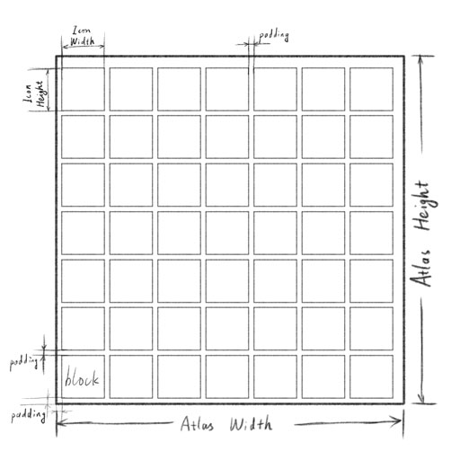
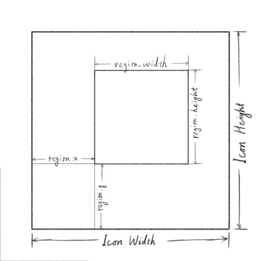
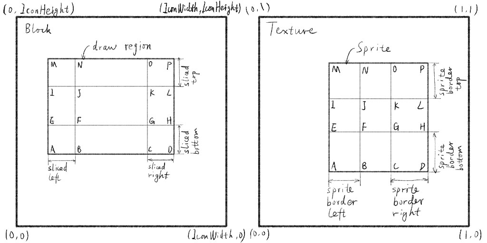
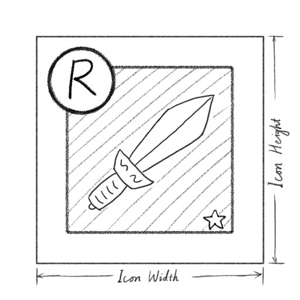
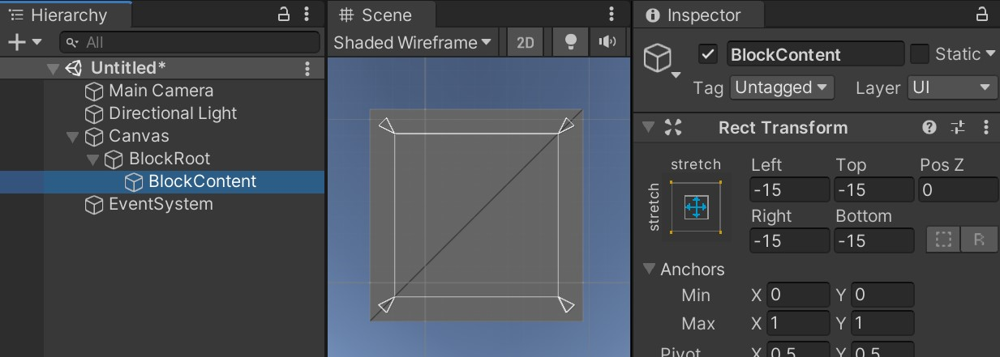

# RenderTextureIcons

---

[README in English](./README.md)

## 名词解释

**注：** 此文档中使用的名词与API中使用的单词可能并不一致。对于此方案中来说，下文中的图标图片（Icon）与其他图标格子（Block）中的元素一样，都是贴图。

### 图标图片（Icon）

此文档中，规定“图标图片（Icon）”为用于展示游戏中特定物件的图标样式的贴图资源。

例如：100px \* 100px的英雄头像，图集中100px \* 100px的装备图标sprite。

### 图标格子（Block）

此文档中，规定“图标格子（Block）”为一个包含了背景、图标图片、图标边框以及其他可视化属性元素的集合。简称格子。

例如：背包界面的物品列表中的一个元素，奖励道具列表中的一个元素。

## 概述

通常在游戏中，一个道具格子会由背景、图标图片、边框以及在其边角上用于展示属性的元素组成。

上述内容通常由一个包含了上述元素为子节点的的prefab来实现。同时这个prefab也将被大量UI界面prefab资源引用。

一个MMO游戏中的所有图标图片的数量，达到数百上千者屡见不鲜。

所以游戏开发者通常会遇到下面的这些问题：

- 修改道具格子prefab资源时，可能会遇到各种问题。

- 在初始化背包界面时，可能因背包格子中子节点而有数以千计的UGUI Image组件，这些组件的脚本执行可能会造成CPU压力。

- 若将图标图片打成图集，则图集数量会远大于1，增加显存占用。

- 在同时显示源于多个贴图的内容时，将不得draw call的优化，在有文本穿插的情况下会更加明显。

- 在道具格子区域会有明显的overdraw。

- 对道具格子进行整体的置灰或颜色调整会有较高的实现成本。

若使用此方案：

- 仅需要一个RawImage组件即可显示一个格子中的全部内容。

- 所有格子的RawImage组件渲染的内容，均源自一张大贴图。

- 可轻松控制全部或部分元素的颜色变化。

需要开发者进行的操作：

- 格子中所有元素都将使用API进行绘制。

- 在绘制逻辑中要正确申请并及时释放从图集中申请的区域。

- 由于RenderTexture可能会被清空，绘制逻辑要实现重绘格子内容的逻辑。

### 优势

- 显著减少所需的UI节点数量，初始化道具格子UI时CPU消耗降低。

- 所需每帧的drawcall数量以及格子区域的overdraw数量均明显减少。

- 在初始化道具格子UI时，将使用此时闲置的GPU对格子中的内容进行内容绘制，充分利用硬件资源。

- 结合将文本渲染成图片的工具，将得到更好的优化效果。

- 基于整个道具格子的特效更易实现。

- 图标图片资源可按需加载，在调用完绘制API后，图片资源即可释放。

### 限制

- 所有的格子UI必须为同一尺寸，或者接受尺寸缩放。

- 格子中各元素的源内容，不支持动画。

- 同时处于激活状态的格子数量有上限，并通过项目优化以保证在任何时候不会超此上限。

## 核心代码

### RenderTextureIcons

此方案的核心类，用于管理图集、执行绘制逻辑，并提供下列接口：

- 获取图集的texture

- 图集中区域的申请和释放方法（`AllocIcon`和`ReleaseIcon`）

- 绘制、清空的方法

### IconDrawProperties

一个定义了所有额外绘制属性的结构体。额外属性包括：

- 绘制区域

- 颜色转换

- 九宫格所需属性

- 遮罩

### ColorMatrix

用于IconDrawProperties，它指定了在绘制时，贴图中颜色转换的逻辑。

对贴图中的颜色`in`使用`m`转换矩阵，最终得到颜色`out`的计算过程：

    out.r = in.r * m.rr + in.g * m.gr + in.b * m.br + m.rc
    out.g = in.r * m.rg + in.g * m.gg + in.b * m.bg + m.gc
    out.b = in.r * m.rb + in.g * m.gb + in.b * m.bb + m.bc
    out.a = in.a * m.alpha

ColorMatrix提供了静态属性和工厂方法用于创建默认、饱和度调整和颜色叠加矩阵，你也可以根据实际需求手动调整矩阵中的参数。

## 在格子中绘制元素

### 格子区域

图集中的一个区域用于绘制一个格子中的内容。

### 绘制区域

绘制区域中格子区域中的一个矩形区域。

### 遮罩区域

在绘制元素时，遮罩区域只能为`eMaskRegionType.IconRegion`或`eMaskRegionType.DrawRegion`。详见前一小节中的贴图。

遮罩贴图将被缩放以完整填充目标区域，在绘制时用于计算混合的颜色值，是源贴图中的色值与遮罩中的色值的乘积。

### 九宫格贴图

将texture中的sprite（上图右半部分）绘制到格子中的绘制区域（上图左半部分）时，需要传入绘制区域中所有sliced size和sprite的所有border uv size数值。绘制区域中A-P点的像素颜色与sprite的对应点的颜色值相同，其他像素点的颜色值将使用插值计算。

使用`IconDrawProperties.SetSliced`方法传入所有sliced size，使用`IconDrawProperties.SetSpriteBorders`方法传入所有border uv size。

## 注意事项

- 清空及绘制方法仅在初始化、重绘或展示内容需要修改时调用。

- RenderTexture可能会在应用切至后台时被清空，所以对于每个格子，都要实现重绘的回调函数，此函数将在图集清空后首次帧展示前被调用。

- 格子中所有的展示内容都要靠API来进行绘制，所有坐标、区域及其他绘制参数都要自行计算。

- 对于`IconDrawProperties`和`ColorMatrix`，建议不要使用new关键字来创建。

- 在不再需要绘制时，直接使用图集的逻辑代码应及时释放申请来的图集区域。

## 推荐做法

### 有关于图集贴图尺寸

在创建`RenderTextureIcons`实例时，需要传入图集的尺寸。

由于RenderTexture不可压缩，所以图集尺寸的宽和高数值都不需要是2的n次方。

推荐的图集宽高的计算方法为：

  width = (icon_width + padding) * columns + padding

  height = (icon_height + padding) * rows + padding

### 关于格子中的通用元素资源

格子中的元素包括背景、边框、边角上的标记、状态标识、表示品质的星星以及表示等级的各种符号等。

这些元素通常都是些小图，并且通常被打进SpriteAtlas。

推荐在程序启动时就将些图集加载到内存中，并且常驻内存，以方便在绘制道具格子时，这些图片资源能够快速同步读取到。

### 关于图标图片资源的加载与卸载

建议不要在绘制完道具格子后立即将图标图片进行卸载。在背包界面的循环列表中玩家频繁上下划动列表，频繁在同一个道具相关的界面间转跳时，都会频繁用到同一张或几张图标图片。

若在图片图片资源的最后一次使用后暂存几秒钟，即可显著降低IO开销以维持帧频稳定。

### 在边框外的格子内容

在某些界面设计中，道具格子角上的标签可能会超出道具的边框所在的区域。

此情况下，推荐引入一个inner-padding的概念，以实现边框区域与格子区域外围间的留白。

在编辑器中，通过使道具格子的RawImage的RectTransform扩展其父节点在四个方向上的尺寸，可以实现道具根节点的矩形区域与道具格子内容中边框区域的精准的控制。

 

## 关于性能

### CPU

- 一个用于侦听Update事件的脚本，每帧少量检查逻辑。

- 每100次绘制方法调用占用的CPU时间少于1毫秒。

### GPU

- 每调用一次绘制方法便会产生一个drawcall。

- 单个canvas中，所有格子的RawImage可以轻松优化到一个drawcall之中。

- 绘制100个尺寸为100px*100px的道具格子所消耗的GPU时间大约与一到两个屏幕后处理特效的时间相当。

### 内存、显存

- 每个图集一张RenderTexture，2048x2048 RGBA32的贴图占用16M。

- 2个shader资源，2个材质实例，一个2x2的Texture2D。
